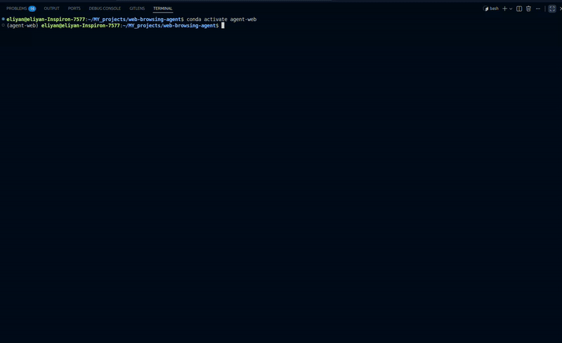

# Web Browsing Multi-Agent Workflow

We're building a local, multi-agent browser automation system powered by CrewAI and Stagehand. It leverages autonomous agents to plan, execute, and synthesize web automation tasks using natural language queries.



How It Works:

1.  **Query Submission**: User submits natural language query describing desired browser automation task.
2.  **Task Planning**: A **Planner Agent** interprets query and generates structured automation plan, including website URL and task description.
3.  **Plan Execution**: **Browser Automation Agent** executes plan using Stagehand Tool, which autonomously navigates web pages, interacts with elements, and extracts relevant content.
4.  **Response Synthesis**: **Synthesis Agent** takes raw output from execution phase and converts it into clean user-friendly response.
5.  **Final Output**: User receives a polished result containing results of web automation task, such as extracted data or completed actions.

We use:

- [Stagehand](https://docs.stagehand.dev/) for open-source AI browser automation
- [CrewAI](https://docs.crewai.com) for multi-agent orchestration

## Set Up

Follow these steps one by one:

### Create Conda Environment

Use the provided [environment.yml](environment.yml) to create the conda environment:

```bash
conda env create -f environment.yml
conda activate agent-web
```

### Create .env File

Create a `.env` file in the root directory of your project with the following content:

```env
OPENAI_API_KEY=<your_openai_api_key>
MODEL_API_KEY=<your_openai_api_key>
PLANNER_LLM_MODEL=openai/gpt-5-mini
AUTOMATION_LLM_MODEL=openai/gpt-5-mini
RESPONSE_LLM_MODEL=openai/gpt-5-mini
```

You must provide valid API keys. `OPENAI_API_KEY` is used by CrewAI LLM calls and `MODEL_API_KEY` is used by Stagehand. If you use a different provider or local gateway, set the appropriate model string(s) in `PLANNER_LLM_MODEL`, `AUTOMATION_LLM_MODEL`, and `RESPONSE_LLM_MODEL` to match your provider, and supply the required API key in `.env`.

### Ollama (Optional)

Ollama is only required if you want to run local models. This project can run entirely on OpenAI by setting the API key(s) and using OpenAI models (see `cli.py`). If your machine is too constrained for local models, you can skip Ollama.
Recommned models for local use: gpt-oss, gpt-oss-safeguard, ashlog/ ash-0.2-20b, etc.


### Install Playwright System Dependencies & Browsers

Install system dependencies and browser binaries:

```bash
playwright install-deps
playwright install
```

## Run CrewAI Agentic Workflow

To run the CrewAI flow, execute the following command:

### CLI Usage

You must provide exactly one input source: `-p` or `-f`.

```bash
python cli.py -p "<your prompt>"
python cli.py -f example_prompt.txt
python cli.py -f example_prompt.txt -o result.txt
python cli.py -p "<your prompt>" -v
```

Flags:

- `-p/--prompt` prompt text to run
- `-f/--file` path to a file containing the prompt (example_prompt.txt is for demo only)
- `-o/--output` optional file to save `PROMPT` and `RESULT`
- `-v/--verbose` show detailed execution steps

## Example Prompts
Here are some example prompts you can use to test the workflow:
- "What is the current exchange rate from euro to US dollar?"
- "Find the top 5 news headlines on BBC News."
- "Search for the latest articles on artificial intelligence on TechCrunch and summarize them."